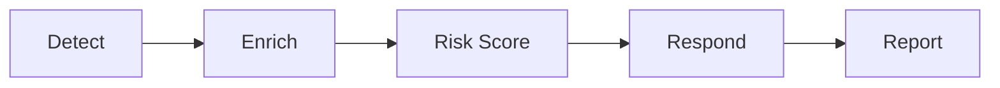

Readme · MD
# Security Automation Pipeline
 
A Python project that checks a suspicious sign-in, scores the risk, and writes a report. A person has to approve any action.
 
[](https://github.com/The1keyy/security-automation-pipeline/actions/workflows/tests.yml)


 
**[Live site](https://the1keyy.github.io/security-automation-pipeline/)** | [Sample output](#sample-output) | [Run it](#run-it) | [Make it yours](#make-it-yours)
 

 
<!-- TODO: add a 10-20 second terminal GIF of a run here, directly under the screenshot -->
 
## What it does
 
When a suspicious sign-in happens, a security team has to work out whether it matters. This project does the first pass automatically:
 
1. **Detects** the suspicious event.
2. **Enriches** it with outside context, such as whether the IP address has a bad reputation.
3. **Scores** how risky it is and how confident the score is.
4. **Proposes a response** and waits for a person to approve it.
5. **Writes a report** a human can read.
> [!IMPORTANT]
> This is a synthetic portfolio lab, not a production detection benchmark. It does not change live accounts, sessions, or firewall rules.
 
## Why this exists
 
A SOC (security operations center, the team that watches for attacks) cannot investigate every alert. This pipeline adds context, a separate confidence score, and a person in the loop before containment.
 
## How it works
 

 
| Stage | What happens | Where in the code |
|---|---|---|
| Detect | 14 sign-in rules flag suspicious events | `detections/` |
| Enrich | IP reputation lookups from 8 sources, with a local cache | `enrichment/` |
| Risk score | Explainable score plus a separate confidence value | `risk/`, `config/` |
| Respond | Approval, allowlists, playbooks, dry-run, audit, rollback | `response/` |
| Report | Plain text and HTML incident reports | `reports/` |
 
## Key results
 
| What | Result |
|---|---|
| Sign-in detectors | 14, including brute force, password spray, impossible travel, and MFA fatigue |
| Automated tests | 13 `pytest` checks, including a benign login that must stay quiet |
| Enrichment sources | 8, and one failing source does not stop the others |
| Risk score | Capped at 90, split into threat, behavior, impact, and correlation |
| Sample case | Risk 86/90, confidence 10/10, severity CRITICAL, approval required |
| ATT&CK mapping | 4 techniques in the sample: T1078, T1621, T1098, T1114.003 |
 
Accuracy on the bundled synthetic scenarios only: precision 1.00, recall 1.00, false-positive rate 0.00. **These are not production accuracy numbers.**
 
## Sample output
 
From the synthetic case in [`reports/sample/incident_report.txt`](reports/sample/incident_report.txt):
 
```text
Severity: CRITICAL
Risk Score: 86/90
Confidence: 10/10
Action: PREAPPROVED_PLAYBOOK_ONLY
Requires Approval: True
Automatic: False
```
 
How to read it: the risk score says how dangerous the event looks, and confidence says how sure the pipeline is. `Automatic: False` and `Requires Approval: True` mean nothing runs until a person approves the playbook.
 
Screenshots from each stage are in [`ss/`](ss).
 
## Run it
 
You need Python 3.11 or newer.
 
```bash
git clone https://github.com/The1keyy/security-automation-pipeline.git
cd security-automation-pipeline
python3 -m venv .venv && source .venv/bin/activate
pip install -r requirements.txt
pytest
```
 
If the tests pass, the install works. To run the pipeline:
 
```bash
cp .env.example .env      # then add your provider keys
python3 main.py
```
 
The keys in `.env` are `ABUSEIPDB_API_KEY`, `VIRUSTOTAL_API_KEY`, `GREYNOISE_API_KEY`, and `OTX_API_KEY`.
 
## Make it yours
 
This is MIT licensed, so copy it, change it, and break it.
 
1. **[Use this template](https://github.com/The1keyy/security-automation-pipeline/generate)** or **[fork it](https://github.com/The1keyy/security-automation-pipeline/fork)**.
2. Run `pytest` to confirm a clean start.
3. Change something and see what fails.
Ideas to try: a new detector in `detections/`, another enrichment source, a new response playbook, or a different report format. See [CONTRIBUTING.md](CONTRIBUTING.md) before opening a pull request.
 
<details>
<summary>Project structure</summary>
```text
detections/     sign-in rules
enrichment/     IP intel lookups and a local cache
risk/           explainable score and severity
response/       approval, allowlists, playbooks, dry-run, audit, rollback
reports/        text and HTML writers, plus reports/sample/
tests/          pytest suite
config/         weights and thresholds
sample_logs/    synthetic events
ss/             screenshots from the lab runs
docs/           GitHub Pages site
```
 
Demo scripts stay at the repo root. `pytest` runs only `tests/`.
 
</details>
<details>
<summary>Research basis</summary>
The score is research-inspired. It does not reproduce the cited models, and it does not calculate CVSS for alerts.
 
- [AlertPro, Computers & Security, 2024](https://doi.org/10.1016/j.cose.2023.103583): prioritize with context
- [Guo et al., 2026](https://doi.org/10.1007/s44443-026-01172-w): score across more than one dimension
- [NIST SP 800-30 Rev. 1](https://doi.org/10.6028/NIST.SP.800-30r1): likelihood, context, and impact
- [MITRE ATT&CK](https://attack.mitre.org/): map behavior to techniques
- [CVSS v4.0](https://www.first.org/cvss/v4.0/): a model for clear components and severity bands only
</details>
<details>
<summary>Glossary</summary>
- **SOC**: security operations center, the team that monitors and responds to attacks.
- **Enrichment**: adding outside context to an alert, such as IP reputation.
- **MITRE ATT&CK**: a public catalog of attacker techniques. Each technique has an ID like T1078.
- **Impossible travel**: two sign-ins from places too far apart for one person to travel between in that time.
- **Password spray**: trying a few common passwords against many accounts.
- **MFA fatigue**: spamming approval prompts until the user accepts one.
- **ASN**: the identifier of the network that owns an IP address.
- **Playbook**: a predefined set of response steps.
</details>
## Roadmap
 
- [ ] Treat a missing ASN as unknown, instead of as a match, in impossible travel
- [ ] Run detect, score, and report from one command
## Tech stack
 
Python, pytest, requests, and the provider APIs above. Reports are plain text and HTML. The site in `docs/` has no build step.
 
## About
 
Keyshawn Jeannot | [LinkedIn](https://www.linkedin.com/in/keyshawnjeannot)
 
Released under the [MIT license](LICENSE).
