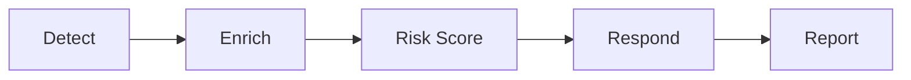

# Security Automation Pipeline

Detects, enriches, scores, and responds to security events automatically.

 [](https://github.com/The1keyy/security-automation-pipeline/actions/workflows/tests.yml)  [](https://the1keyy.github.io/security-automation-pipeline/)


## Why this exists

A SOC cannot investigate every alert. This pipeline adds context, a separate confidence score, and a person in the loop before containment.

It is a synthetic portfolio lab. It is not a production detection benchmark, and it does not change live accounts, sessions, or firewall rules.



## Key results

- 14 sign-in detectors, including brute force, spray, impossible travel, and MFA fatigue
- 13 pytest checks, including a benign login that stays quiet
- 8 enrichment sources, and one failure does not stop the others
- Risk is capped at 90 and split into threat, behavior, impact, and correlation
- Sample case: 86/90, confidence 10/10, severity CRITICAL, approval required
- 4 ATT&CK techniques in that sample: T1078, T1621, T1098, T1114.003
- On the bundled synthetic scenarios only: precision 1.00, recall 1.00, false-positive rate 0.00

Those metrics are not production accuracy.

## Quick start

```bash
python3 -m venv .venv && source .venv/bin/activate
pip install -r requirements.txt
pytest
```

Copy `.env.example` to `.env` before `python3 main.py`. The names are `ABUSEIPDB_API_KEY`, `VIRUSTOTAL_API_KEY`, `GREYNOISE_API_KEY`, and `OTX_API_KEY`.

## Project structure

```text
detections/     sign-in rules
enrichment/     IP intel lookups and a local cache
risk/           explainable score and severity
response/       approval, allowlists, playbooks, dry-run, audit, rollback
reports/        text and HTML writers, plus reports/sample/
tests/          pytest suite
config/         weights and thresholds
sample_logs/    synthetic events
ss/             screenshots from the lab runs
docs/           GitHub Pages site
```

Demo scripts stay at the repo root. `pytest` runs only `tests/`.

## Sample output

From the synthetic case in `reports/sample/incident_report.txt`:

```text
Severity: CRITICAL
Risk Score: 86/90
Confidence: 10/10
Action: PREAPPROVED_PLAYBOOK_ONLY
Requires Approval: True
Automatic: False
```

Full runs for each stage are in [`ss`](ss).

## Research basis

The score is research-inspired. It does not reproduce the cited models, and it does not calculate CVSS for alerts.

- [AlertPro, Computers & Security, 2024](https://doi.org/10.1016/j.cose.2023.103583): prioritize with context
- [Guo et al., 2026](https://doi.org/10.1007/s44443-026-01172-w): score across more than one dimension
- [NIST SP 800-30 Rev. 1](https://doi.org/10.6028/NIST.SP.800-30r1): likelihood, context, and impact
- [MITRE ATT&CK](https://attack.mitre.org/): map behavior to techniques
- [CVSS v4.0](https://www.first.org/cvss/v4.0/): a model for clear components and severity bands only

## Tech stack

Python 3.13, pytest, requests, and the provider APIs above. Reports are plain text and HTML. The site in `docs/` has no build step.

## Roadmap

- Treat a missing ASN as unknown, instead of as a match, in impossible travel
- Run detect, score, and report from one command
- Add a résumé PDF

## About

**Keyshawn Jeannot**, Information Security Analyst.

- [LinkedIn](https://www.linkedin.com/in/keyshawnjeannot)
- Résumé: coming soon
- [Live site](https://the1keyy.github.io/security-automation-pipeline/)
- [Source](https://github.com/The1keyy/security-automation-pipeline)

## License

[MIT](LICENSE)
